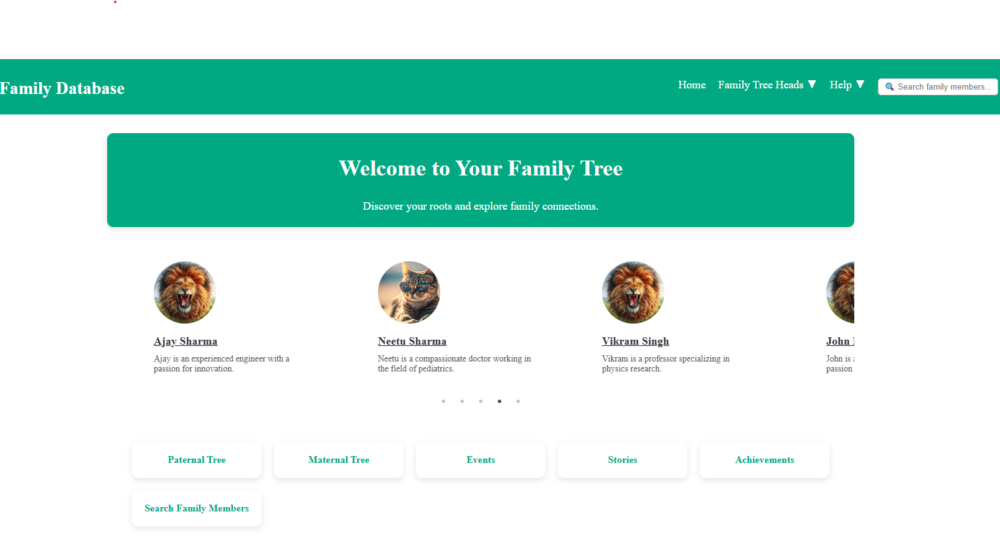

> ⚠️ **Work In Progress:** This repository is currently under active development. Features and documentation may change frequently. wait for few day untill i complete it.

# 🌳 Family Tree Website

## 📝 Project Overview
The **Family Tree Website** helps families organize and visualize their lineage. Users can explore their heritage through a dynamic tree structure, storing relationships and details efficiently.

## 🚀 Features
- 📍 **Interactive Tree Visualization** – Navigate through generations with ease.
- 🗂 **Database Integration** – Store detailed family member records.
- 🔒 **Authentication & Roles** – Control edit access for data security.
- 🔍 **Search & Filtering** – Find family members quickly.
- 📱 **Mobile-Responsive Design** – Works across all devices.

## ⚙️ Technology Stack
| Component     | Technology Options |
|--------------|-------------------|
| Front-End    | React.js |
| Back-End     | Node.js / Express.js  |
| Database     | PostgreSQL |
| Tree Visualization | D3.js / Treant.js (TBD)|
| Hosting      | AWS / Firebase / Heroku (TBD)|

## 🔨 Setup Instructions
### **1️⃣ Clone the Repository**
```bash
git clone https://github.com/RaayanRealm/familytree.git
cd familytree
```
## How to run
- nodemon index.js
- npm run dev

## How website looks


## ✨ Contributions
Feel free to open issues or pull requests to enhance the project.
## 📜 License
This project is licensed under MIT License – Free to use and modify.
## 📧 Contact
For queries, contact raayany@outlook.com.
